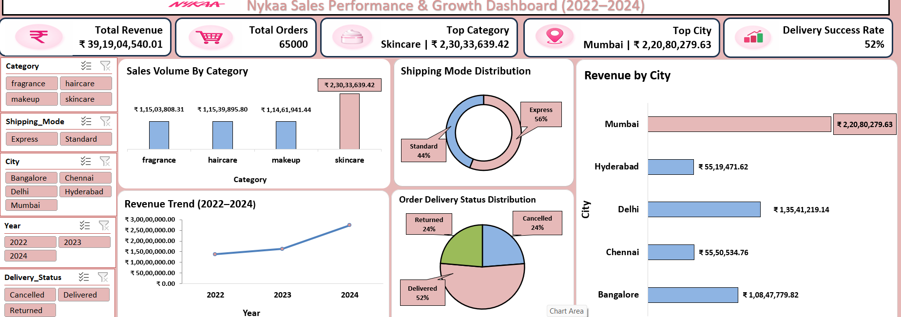

# Nykaa Sales Data Analysis Dashboard

This project presents an interactive Sales Analysis Dashboard based on the Nykaa dataset. The data was cleaned using Python and visualized using Microsoft Excel to generate meaningful business insights.

The dashboard provides a clear view of sales performance, product categories, trends, and overall business behavior to support data-driven decision-making.

---

## Objective

- Analyze sales data efficiently  
- Track overall sales performance  
- Identify top-performing categories and products  
- Understand sales trends and patterns  
- Provide clear business insights through visualization  

---

## Data Cleaning (Python)

Data preprocessing and cleaning were performed using Python in Jupyter Notebook.

- Removed missing values  
- Handled duplicate records  
- Converted data types  
- Cleaned and formatted columns  
- Prepared dataset for analysis  

File: `Nykaa project.ipynb`

---

## Dashboard (Excel)

An interactive dashboard was created using Microsoft Excel after data cleaning.

- Pivot Tables and Pivot Charts  
- Slicers (interactive filters)  
- KPI indicators  
- Charts (Bar, Pie, Line)  
- Dashboard formatting and design  

File: `Project Nykaa.xlsx`

---

## Key Dashboard Metrics

- Total Sales  
- Category-wise Sales  
- Product Performance  
- Sales Trends  
- Top and Low Performing Categories  

---

## Dashboard Preview

## Key Insights

- Identified top-performing categories contributing maximum sales  
- Highlighted low-performing areas that need improvement  
- Analyzed sales trends over time  
- Provided insights for better business decision-making  

---

## Conclusion

This project demonstrates an end-to-end data analysis process including data cleaning, transformation, and dashboard creation.

It helps in understanding business performance and supports data-driven decisions.

---

## Tools & Techniques Used

- Python (Pandas, NumPy)  
- Jupyter Notebook  
- Microsoft Excel  
- Pivot Tables and Charts  
- Slicers and KPI metrics  

---

## Project Structure
Nykaa-Data-Analysis/
│
├── Nykaa project.ipynb
├── Project Nykaa.xlsx
└── README.md
